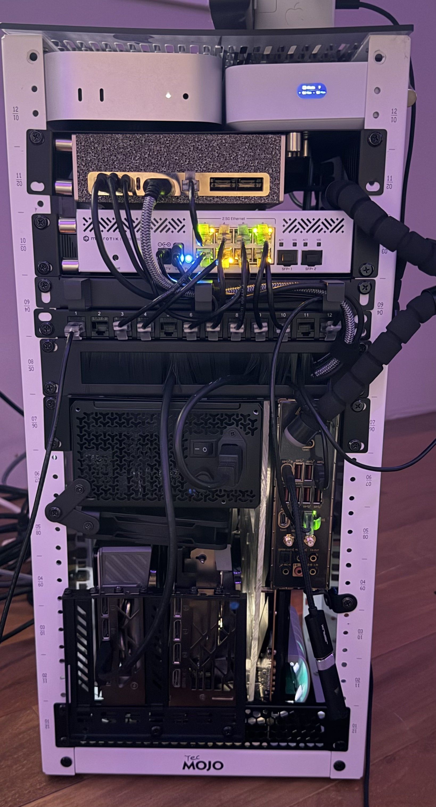

# mini-rack-cluster

A 10-inch mini rack that consolidates a 3-node home fleet — dev workstation
with dual GPUs, an AI inference server, and a general-purpose server host —
plus its network gear, into one enclosure.



## Fleet

| Node | Role | Hardware |
|---|---|---|
| **nova-linux** | Dev workstation + GPU compute | MSI MEG X670E ACE (vertical-mounted on a hand-cut acrylic plate), Ryzen 9 9950X, RTX 5080 + RTX 4070 Ti, 32GB DDR5-4800, WD_BLACK SN850X 4TB + SN770 2TB NVMe |
| **machub** | General server host | Mac mini M4 (base, 16GB/256GB) — Vault, Postgres, IB/TWS, game streaming |
| **spark-a81e** | AI inference node | NVIDIA DGX Spark, GB10 Grace-Blackwell, 128GB unified memory — ollama model serving |
| — | Switch | MikroTik CRS310-8G+2S+ |
| — | Gateway/router | UniFi UX7 (UDMA69B) |

Each node kept its existing role from the wider fleet (see
[`personal-pc-config`](https://github.com/Cschaefer732/personal-pc-config) for full
per-machine config) — this project is the physical consolidation into one rack, not a
new cluster software stack.

## Build notes

- The MSI X670E ACE doesn't fit a standard 10" rack shelf full-size, so the board was
  pulled from its original case and mounted vertically on a cut acrylic open-frame
  plate to fit the rack footprint.
- PCIe 5.0 riser cables carry both GPUs off-board to clear rack depth (RGEEK x16
  double-reverse riser for one card, TRYX vertical-mount riser for the other).
- Cooling: ARCTIC Liquid Freezer III Pro 360 AIO on the 9950X, OwlTree PWM fan hub for
  case/rack fans.
- Power: Corsair RM850e (850W, fully modular) for the compute node.
- Cable management: Tecmojo 12-port Cat6 patch panel, GeeekPi horizontal cable manager,
  Tecmojo brush cable-entry panel, Cat6a patch cables throughout.
- Enclosure: Tecmojo 12U 10" network rack, 10.23" deep.

## Parts list + pricing

Two columns: what was actually paid (or, for parts reused from the prior nova-linux
build, the original MSRP — no receipt on hand), vs. current market price as of
2026-09-26.

| Component | Price Paid / Original | Market Price Now |
|---|---|---|
| NVIDIA DGX Spark (GB10, 128GB unified) | $4,800 | $4,699 (NVIDIA FE) — OEM partner street price ranges $4,100–$7,900 |
| MSI GeForce RTX 5080 Gaming Trio | $1,400 | ~$1,199–$1,800 (avg ~$1,580) |
| Apple Mac mini M4 (16GB/256GB) | $500 | ~$700–$1,050 — discontinued May 2026, resale now above launch price |
| MSI MEG X670E ACE motherboard | $699.99 (MSRP, reused part — no receipt) | $799.99 |
| AMD Ryzen 9 9950X | $649 (MSRP, reused part) | ~$499.99 |
| MSI GeForce RTX 4070 Ti Gaming Trio | ~$874 (MSRP, reused part) | ~$809.99 |
| WD_BLACK SN850X 4TB NVMe | $699 (MSRP, reused part) | ~$639.99 (volatile, seen $270–$640) |
| WD_BLACK SN770 2TB NVMe | $269.99 (MSRP, reused part) | ~$400 (NAND shortage) |
| Crucial 32GB DDR5-4800 (CT32G48C40U5) | ~$110 (est., no clean launch record) | ~$268–$538 (DRAM shortage) |
| MikroTik CRS310-8G+2S+ switch | $208.80 | $208.80 |
| UniFi UX7 gateway | $234 | $199 |
| Tecmojo 12U 10" rack enclosure | $139.90 | $139.90 |
| Corsair RM850e 850W PSU | $115.99 | $115.99 |
| TRYX PCIe 5.0 vertical riser | ~$74.99 | $74.99 |
| ARCTIC Liquid Freezer III Pro 360 AIO | ~$74.99 | $69.89 |
| RGEEK PCIe 5.0 x16 double-reverse riser | $39.99 | $39.99 |
| DIY acrylic open-frame case (cut for vertical mobo mount) | $29.89 | $29.89 |
| Tecmojo 12-port Cat6 patch panel | $15.99 | $15.99 |
| Tecmojo brush cable-entry panel | $14.69 | $14.69 |
| OwlTree 4-pin PWM fan controller | $16.99 | $16.99 |
| GeeekPi 10" horizontal cable manager | $11.19 | $11.19 |
| Cat6a patch cables (10-pack) | $10.99 | $10.99 |
| **Total** | **~$10,990** | **~$11,519** |

Build cost went *up* since assembly — the 2026 AI-driven GPU/NAND/DRAM shortage
outpaced normal depreciation on every reused part.

## Repo layout

```
docs/           build write-ups, LinkedIn post draft, photos
configs/        network device summaries (port maps, gateway notes — no raw exports)
cad/            parametric OpenSCAD model for the slide-out mobo/GPU/PSU tray
scripts/        automation — TODO, none written yet
wiki/           Obsidian-compatible knowledge layer for this project
```

## Status

- [x] Physical build complete
- [x] Parts + pricing documented
- [x] Build photos added (`docs/photos/`)
- [ ] Slide-out mobo/GPU/PSU tray — v0.4 CAD draft in `cad/` (layout verified against build photo, real PSU/mobo mounting holes sourced, rack reference frame), needs rack-width measurement + dry-fit before printing
- [ ] Rack elevation / wiring diagram
- [ ] `scripts/` — no automation defined yet
