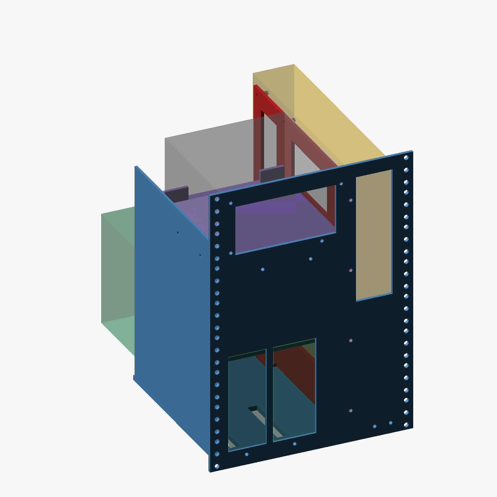

# Slide-out tray v1.0

Rebuilt from zero on 2026-09-29. Source, spec and audit live in
[`asset-forge/3d-design/assets/rack-tray/`](https://github.com/Cschaefer732/asset-forge/tree/main/3d-design/assets/rack-tray);
this folder holds the published outputs. Supersedes the OpenSCAD v0.1-0.6 in the parent folder,
which modelled the motherboard facing the front instead of standing edge-on.

## What it is

An 8U (354.8 mm) faceplate for a 10-inch rack with EIA-310 ear holes down both sides, and a
printed chassis behind it:

- **PSU** (top-left): rear face on the faceplate, four screw holes plus a window, resting on a shelf
  with a wall on its left and stops behind it.
- **Motherboard** (right): stands edge-on like in a PC tower, IO edge to the front, portrait IO
  window in the faceplate, a printed frame at X 156-160 mm carrying the ten ATX standoff holes.
  It hangs out the back.
- **GPUs** (bottom-left): PCIe fingers down, port brackets facing out through two windows, bracket
  tab screwed to a ledge behind the faceplate.
- Slide interface: eight placeholder holes in the base for under-mount slides.

| File | Part |
|---|---|
| `faceplate.stl/.step` | 254 x 354.8 x 12 mm |
| `base` | 222 x 236 x 20 mm |
| `left_wall` | 270 x 232 x 18 mm |
| `psu_shelf` (purple in the viewer) | 170 x 153 x 40 mm |
| `board_frame` (red in the viewer) | 331 x 248 x 32 mm |

All fit a 360 mm bed. `report.json` is the audit output (280 checks, exit 0).

## How it was checked

Numbers, not renders: watertight and single-body, bounds, an independent volume balance, probes that
test both the hole and the material around it, interference / clearance / contact between parts and
reference bodies for the PSU, board and cards, rack-opening envelope, print-bed fit. Nine
deliberate sabotages of the builder (rotated window, mirrored holes, shifted hole, swapped axes,
missing hole, cutter that misses...) each fail the real spec. See
`asset-forge/3d-design/README.md`.

## Before printing (full list in the asset README)

1. Measure the rack opening: 222.25 mm is assumed and the layout uses all of it.
2. Side-mount slides do not fit (they need 25 mm); pick under-mount slides and replace the base holes.
3. Confirm PSU depth (160 mm assumed) and the PSU screw pattern's handedness, the 4070 Ti size
   (337 x 140 x 56 assumed), and the 50 mm of component height allowed above the PCB.
4. Dry-fit the GPU ledge: the cooler shroud is assumed to start 10 mm behind it.
5. The GPU ledge bridges the two GPU windows when the faceplate is printed face-down. Use supports.
6. No strength analysis yet: ribs may be needed under the PSU shelf and behind the board frame.
